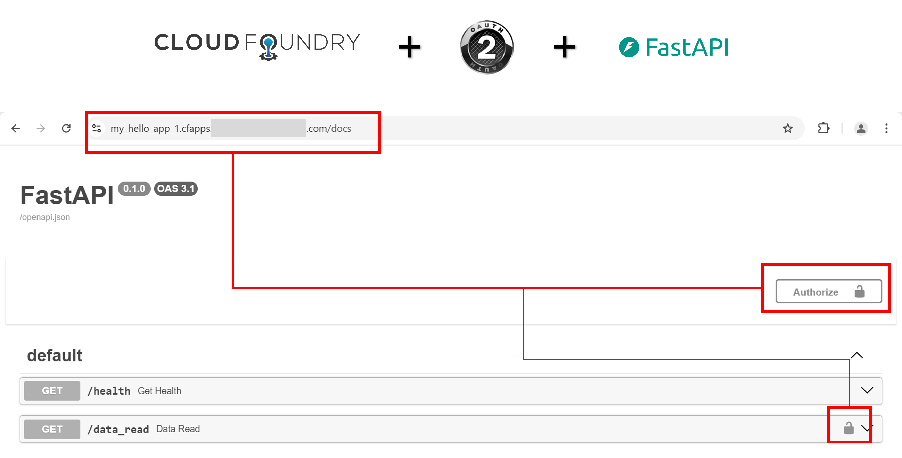
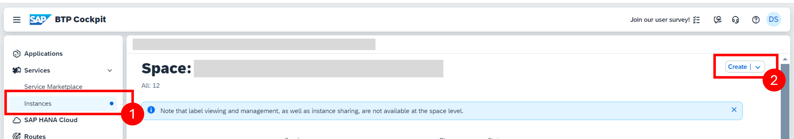
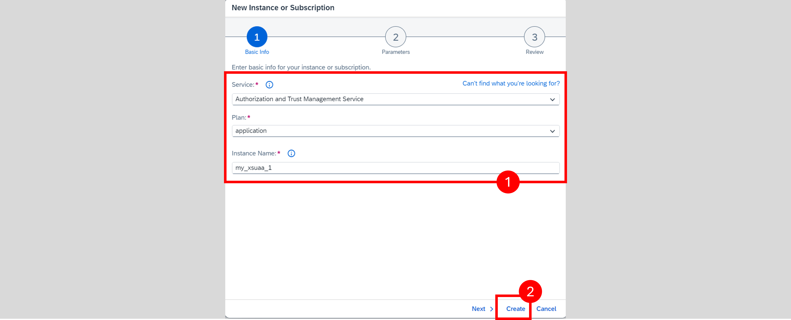
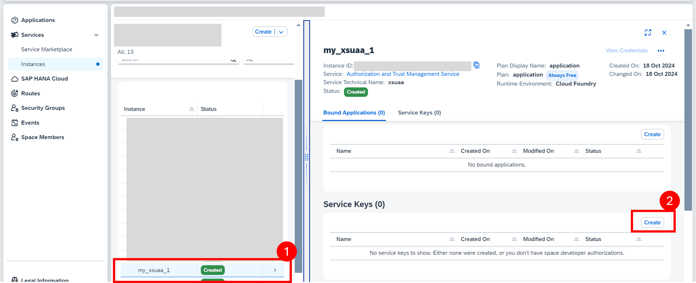
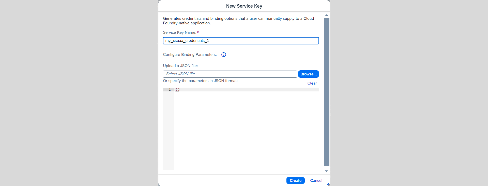
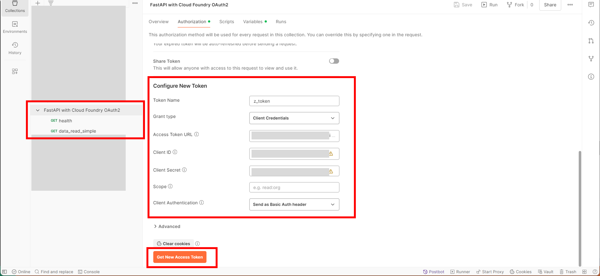
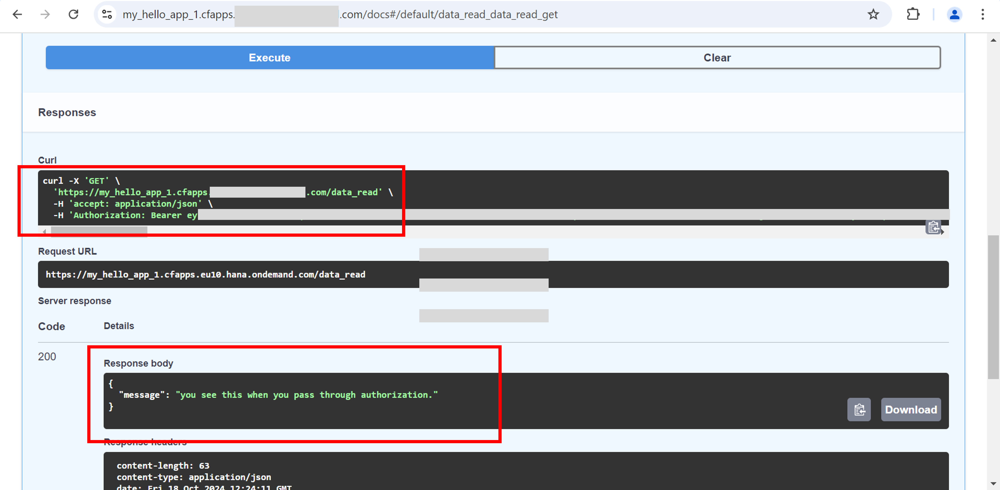
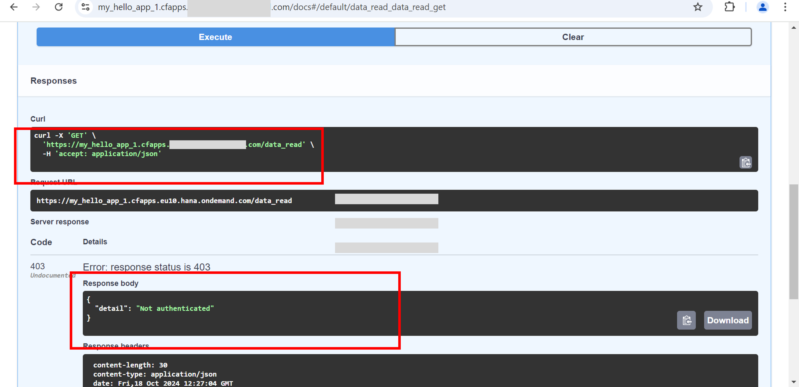
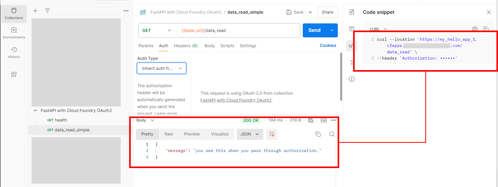

```
Keywords: Python, Cloud Foundry, FastAPI, Dependency Injection
```

# OAuth2 implementation of FastAPI on Cloud Foundry 

**TLDR; Sample app to integrate the authentication service of cloud foundary to bind to your python' FastAPI server. Feel free to take snippets and use on your own app. The snippet also works if you are using Docker image.**



## Update

- For bigger project management (i.e. scaling across multiple *paths* for the server) refer to the article: https://fastapi.tiangolo.com/tutorial/bigger-applications/ which does nothing more than adding Dependency at the object level of flask app.

## Pre-requiste
- Technical complexity: Intermediate
- Have CF CLI installed. See install instruction [here](https://docs.cloudfoundry.org/cf-cli/install-go-cli.html).
- You have priori knowledge on how to deploy and work with apps on CF.
- Preferrable use VS Code or similar IDE.

## Summary of Steps 

1. First you [create a XSUAA service on Cloud Foundry](#step1).

2. Then you [create python sample FastAPI application](#step2) locally. 

3. [Push the local application to CF](#step3) and test it.


## <a id="step1">Step 1: Create a XSUAA service on Cloud Foundry</a>

There are two ways you can achieve this step. I strongly suggest go with **Option B**.

In this step you create a Authorization and Trust service in Cloud Foundry. The service is responsible for **creating** the Json Web Token (JWT).

### Option A: Through CF CLI 

```SH 
# Create instance Authoization and Trust Managemnt 
cf create-service xsuaa application my_xsuaa_1 -c xsuaa_app_config.json

# Create serivce key 
cf create-service-key my_xsuaa_1 my_xsuaa_credentials_1
```

### Option B: Through UI of SAP BTP 

1. Go to you subaccount then in the space where your python application will be located.
2. Expand **Services** then click **Instances** in the left navigation pane. 


3. Add service name `my_xsuaa_1`.


4. Next create a service key `my_xsuaa_credentials_1`.
    
    

    

What is supported ?
- VS Code's debugger file is located in `.vscode` to run the application in debugger for easy testing.


```
https://automatedinventory.authentication.eu10.hana.ondemand.com/oauth/token?grant_type=client_credentials
```

## <a id="step2">Step 2: Create Python Sample FastAPI application</a>


### Virtual Environemnt setup

```SH
# create virtual environment
python -m venv sb-env

## Activate that environment
##  Option A: Preferred; cuz your python version may be different
##            In code, where all places libraries are used; its properly annotated.
pip install "fastapi[standard]" "uvicorn[standard]" cfenv sap-xssec

##  Option B: Using the `requirement.txt file`
# pip install install -r requirements.txt
```

### Code

This sample uses only one `main.py` file where you can find following two path. Just learn how these paths are used and you can extend for your own application.

- GET `/health`

    This is unauthorized endpoint, only to check whether the system is reachable.

- GET `/data_read` 🛡️
    This is **secured** endpoint.
    
    > **Details**: In code snippet you will find the function signature for this path uses the dependency injection functionality, complex name but just see the code, and thats all you need to know, to make it depenedent the on the function `check_authentication`. I am referring to below snippet: 

    ```PYTHON
    ...
    def data_read(
        request: Request, 
        authenticate: Annotated[str, Depends(check_authentication)]   # un-used variable
        ):
    ...
    ```

### Testing Locally

1. See the `if __name__ == '__main__'` function in `main.py`.

2. You can use the VS Code debugger. I have included the appropriate file `.vscode/launch.json` which uses referential path so you dont have to modify it.

3. Go to http://localhost:8080/docs . You will find the default swagger docs.


## <a id="step1">Step 3: Push the local application to CF</a>

The command will automatically include `requirements.txt` file in itself.

```SH
cf push
```

### Generating the Bearer Token 

1. You can use the service keys i.e.  `my_xsuaa_credentials_1` and use `url` within to generate Bearer token.
        
 Just use the token as is in when clicking on **Authorize Button** on swagger docs.

2. Otherwise you can also **create** Postman Collection and set authorization to OAuth2 based on the `my_xsuaa_credentials_1` to generate token.

    

    > `url`/oauth/token  is something you should enter in **Access Token URL** `url` from the `my_xsuaa_credentials_1`

### Swagger Preview

1. Open your deployed apps `url/doc` example:
    http://my_hello_app_1.hana.com/docs .

2. Click **Authorize**. Just paste the bearer token's value. DONT add prefix Bearer.

**With bearer token**


**Without bearer token**



### Postman Preview




## References

1. https://community.sap.com/t5/technology-q-a/how-to-secure-your-cloud-foundry-python-application-with-xsuaa/qaq-p/13736667

2. https://fastapi.tiangolo.com/tutorial/security/first-steps/

3. https://fastapi.tiangolo.com/tutorial/security/oauth2-jwt/#why-use-password-hashing

4.  https://fastapi.tiangolo.com/reference/security/?h=httpbear#fastapi.security.HTTPBearer--example
